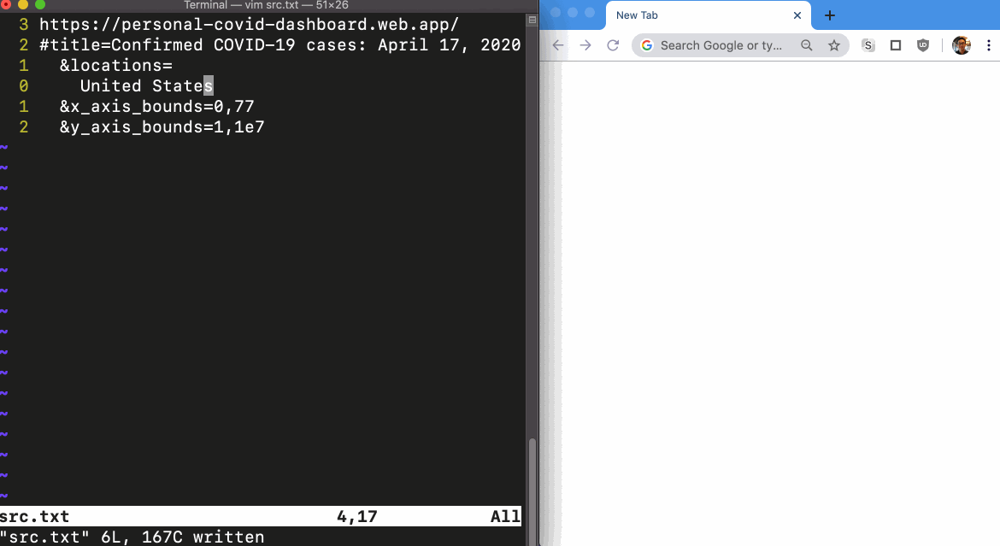

# BYOTextEditor URL Editor

**What is this?** A quick hack: Edit a URL in your favorite text editor and run
`make` to open it in the browser. Useful for editing complicated URL params.

- Newlines are ignored
- Whitespace at the beginning of a line is ignored
- Comments (starting with `;`) are ignored

**Some manual setup required.** Unless you're using Chrome on Mac, you probably
will have to edit `open.sh` to point to your browser.

**Requirements:** `make`, `node`
